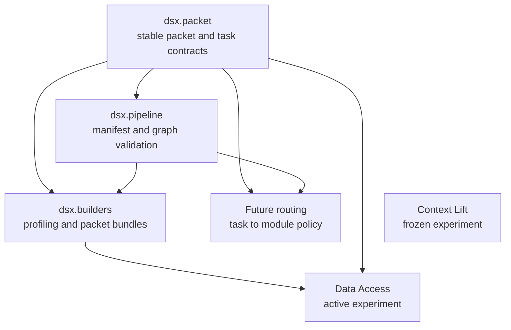

# System Boundaries and Dependency Direction

DSX harness is organized to make DSX Packet capabilities reusable without turning completed studies into a de facto product runtime. The product side defines packet contracts, transformation-history validation, and packet construction. The experiment side owns study protocols, provider execution, scoring, blinded evaluation, and its own evidence artifacts.

## Boundary map



The arrows show permitted reuse direction: `dsx.pipeline` and `dsx.builders` build on packet contracts, and Data Access may consume product code. `dsx.packet`, `dsx.pipeline`, and `dsx.builders` must not import `dsx.experiments`; an AST-based isolation test enforces this across every Python file in those packages. Context Lift and Data Access are separate experiment packages, not alternate implementations of a shared runner.

## Reusable product packages

### `dsx.packet`: durable public contracts

`dsx.packet` is the narrowest reusable layer. Its public API exposes `DatasetRef`, `PacketModule`, `DsxPacket`, `DsTask`, `TaskPacket`, and `assemble_task_packet`.

A `DsxPacket` is an immutable, strict `dsx-packet/v1` envelope bound to a SHA-256 dataset reference. It contains one or more independently versioned modules. A module's `content` intentionally accepts JSON rather than a product-wide schema, while the module type and `schema_version` identify the schema owned by that module's producer. Packet module IDs must be unique, and canonical JSON plus `digest()` provides a deterministic content commitment.

Task-specific use does not create a competing packet format. A `DsTask` declares required module types; `assemble_task_packet` selects every matching module and binds the resulting `TaskPacket` to the source packet ID, packet digest, and dataset digest. Assembly fails when any requested type is absent. This is the extension seam for a future task classifier or router: it can choose a `DsTask` without changing packet storage or task projection semantics.

See [DSX Packets and History](/openwiki/concepts/dsx-packets-and-history.md) for the envelope and provenance model.

### `dsx.pipeline`: declared history, not execution

`dsx.pipeline` owns transformation-manifest contracts and `TransformationGraph`, an in-memory validated graph derived from a manifest. It validates unique snapshot and step IDs, references, one producer per output snapshot, source/non-source roles, reachability of the current snapshot from a source, and acyclicity. It then supplies stable topological orders and lineage traversal to product consumers.

This package does **not** execute transformations or own dataset profiling. Its responsibility is to make declared snapshot lineage safe to consume. Builders use it when a supplied manifest describes a current dataset and historical snapshots.

### `dsx.builders`: build and persist packet bundles

`dsx.builders` is the product integration layer: it profiles a CSV or Parquet current dataset, detects feature and data risks, optionally validates declared transformation history, and assembles a `DsxPacket` and build record. It depends on `dsx.packet` and `dsx.pipeline`, never on experiments.

The public programmatic surface is `build_packet`, `load_previous_bundle`, `write_packet_bundle`, and the packet-build request/result/record models. The `dsx-packet` CLI is the public operational entrypoint:

```bash
uv run dsx-packet build data/train.parquet artifacts/packet-bundle \
  --target label \
  --packet-id fraud-v1 \
  --manifest data/transforms.json
```

The command parses the optional manifest, validates an optional predecessor bundle before deriving its digest, builds in memory, and writes only to a new output directory. Persistence stages files in a temporary sibling directory, reparses and validates them, then renames to the reserved destination. Existing destinations are refused; failed writes clean up the reservation rather than publishing a partial bundle. A normal bundle contains `packet.json` and `build-record.json`, plus normalized `manifest.json` when history was supplied; it never copies the input dataset.

A manifest changes builder control flow in two important ways: the current input digest must equal the manifest's current snapshot digest, and readable historical snapshots must also match their declared digests. The builder can then derive lineage and history-aware traps; absent or empty historical snapshots are reported as unavailable rather than treated as readable evidence.

See [Building Packet Bundles](/openwiki/workflows/building-packet-bundles.md) for the user workflow.

## Experiment boundary

### Context Lift is frozen

`dsx.experiments.context_lift` preserves the original fixed packet-on/packet-off pilot and its historical terminology and artifact contracts for reproducibility. Its public CLI is `dsx-context-lift`; `dsx-pilot` is an intentionally retained compatibility alias. It owns generation of its seeded case and hand-authored packet, request rendering and controlled-delta proof, live model execution, blind export/judgment freeze, and reveal.

Keep product work out of this package. In particular, old names such as `pilot-v1`, `profile_packet`, and its `packet.json` are historical experiment artifacts, not names to introduce in new reusable interfaces. Use the [Context Lift experiment workflow](/openwiki/workflows/context-lift-experiment.md) when operating or reproducing the study.

### Data Access is an active product consumer

`dsx.experiments.data_access` owns a distinct three-arm protocol: opaque packet context, audited direct data discovery, or both. Its public CLI is `dsx-data-access`, with `freeze`, `suite`, `prepare`, `run`, `judge`, `reveal`, and `uptake` commands.

The ordinary `prepare` path deliberately accepts arbitrary JSON as `OpaquePacket`: it canonicalizes and commits it but does not interpret module payloads. It separately materializes the configured source into a DuckDB `dataset` table and records source and materialized digests in the immutable manifest. Before live execution, `run` revalidates those commitments and requires `OPENAI_API_KEY`; the live execution client is imported only after preparation validation, so offline preparation remains independent of provider execution.

Data Access may also call product code in its `freeze` workflow. That workflow copies an eligible tabular source, invokes the builder, assembles the shared review-classifier task projection, and applies study-specific size and signal eligibility checks. This is a one-way dependency: the experiment adapts product output to its protocol; it does not move eligibility, scoring, SQL discovery, provider clients, or blind/reveal logic into the reusable packages.

Use the [Data Access experiment workflow](/openwiki/workflows/data-access-experiment.md) for protocol operations.

## Where to put new work

| Need | Put it here | Keep it out of |
| --- | --- | --- |
| Packet identity, canonical serialization, module invariants, task projection | `src/dsx/packet/` | Experiment-specific schemas and runners |
| Transformation manifest contracts, graph validation, lineage traversal | `src/dsx/pipeline/` | Dataset execution and provider operations |
| Dataset profiling, risk/trap detection, packet assembly, immutable bundle persistence | `src/dsx/builders/` | Scoring rubrics and experiment eligibility policy |
| Deterministic task classification and module selection | a future `src/dsx/routing/` package | Any experiment package unless it remains study-specific |
| Arms, model clients, SQL discovery, ledgers, blinded judging, reveal reports | `src/dsx/experiments/<experiment>/` | Shared product packages |
| Generated input bundles, runs, and blind outputs | ignored `artifacts/<experiment>/` | Source-controlled product packages |
| Stable protocol narrative and results | `docs/experiments/` | Product API contracts |

Do not extract a shared helper merely because both experiments have similar code. Extract only when the current product needs a stable, independently named contract. Conversely, a feature built for packet reuse should start in the product layer and be consumed by an experiment adapter, rather than being developed inside Data Access and copied later.

## Verification that protects the boundary

The focused import-isolation test parses imports in `builders`, `pipeline`, and `packet`, failing if any refer to `dsx.experiments` (including subpackages). It also explicitly confirms that builder files containing product profiling/risk logic are within the scan. This structural test complements package-level behavior tests: it catches an architectural regression even if an experiment import happens to work at runtime.

Run the offline verification gate before changing a boundary:

```bash
uv run pytest -m "not live" \
  --cov=dsx.packet \
  --cov=dsx.pipeline \
  --cov=dsx.builders \
  --cov=dsx.experiments.context_lift \
  --cov=dsx.experiments.data_access \
  --cov-branch --cov-fail-under=100
uv run ruff check .
uv run mypy src
```

For the broader test strategy, see [Verification Strategy](/openwiki/testing/verification-strategy.md). For first use of the public commands, see the [Quickstart](/openwiki/quickstart.md).
