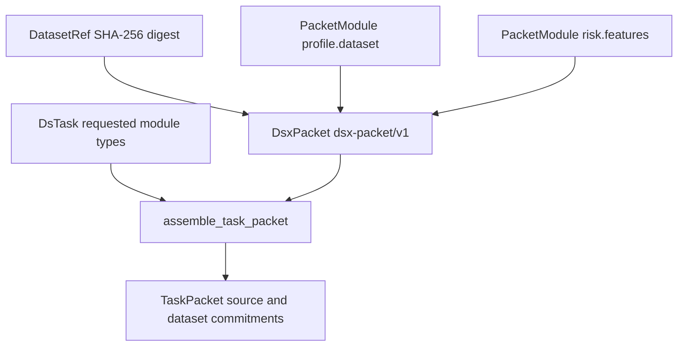
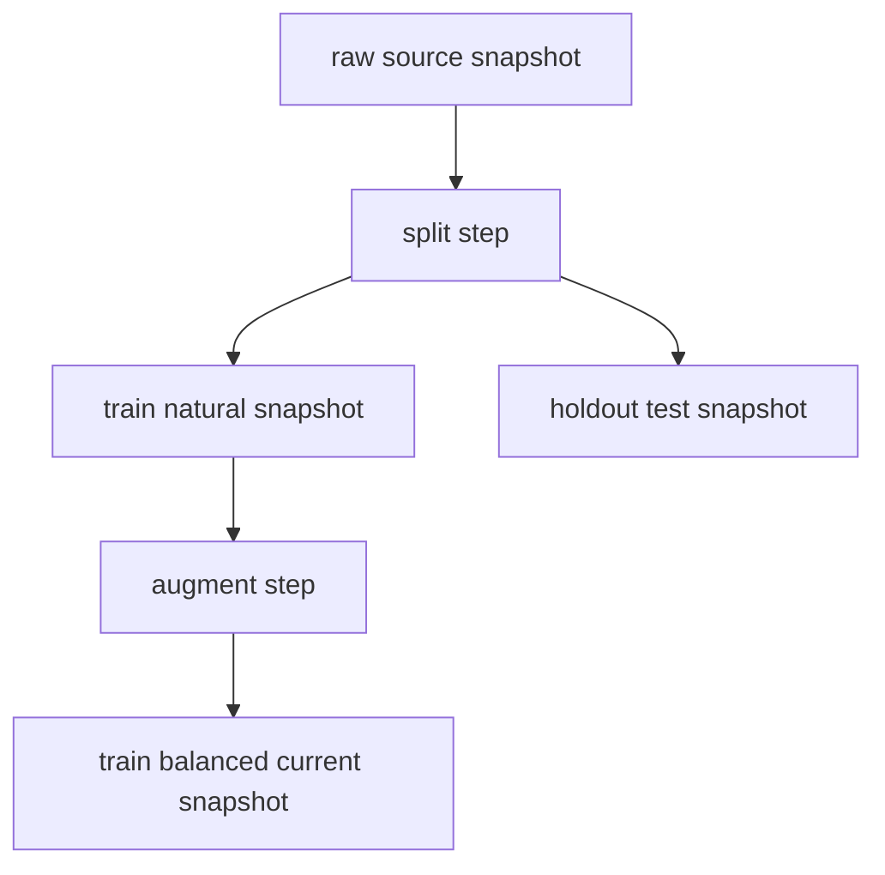

# DSX Packets, Task Projections, and Transformation History

`dsx.packet` and `dsx.pipeline` provide the reusable, in-memory contract layer for dataset context and declared lineage. They do not profile data, execute transformations, persist bundles, or run model experiments. Instead, they establish strict versioned envelopes, deterministic SHA-256 commitments, a declarative task projection, and a validated bipartite graph that downstream code can safely consume. The public entrypoints are `DsxPacket.digest()`, `assemble_task_packet(packet, task)`, and `TransformationGraph.from_manifest(manifest)`.

For the package ownership and the builder/experiment boundary, see [System Boundaries and Dependency Direction](/openwiki/architecture/system-boundaries.md).

## Packet envelope: stable shell, independently owned modules

Every packet contract derives from `PacketContract`, whose Pydantic configuration forbids unknown fields and freezes model attributes. `DsxPacket` is versioned as `dsx-packet/v1` and has a packet ID, a `DatasetRef`, and at least one `PacketModule`. The dataset reference commits to a lowercase, 64-character SHA-256 digest and may carry a human-readable name.

A module is the extension boundary. It has a unique `module_id`, a namespaced `module_type`, its own `schema_version`, JSON `content`, optional evidence references, and tags. The common envelope deliberately does **not** impose a universal schema on `content`: a module producer owns the meaning and evolution of its payload, while consumers use `module_type` and `schema_version` to identify that payload contract. Module content and transformation parameters must serialize as standard JSON, so `NaN` and non-JSON values are rejected. Within a module, evidence references and tags cannot repeat; within a packet, module IDs cannot repeat.

The validation is intentionally structural. It establishes a valid, self-consistent envelope but does not verify that an evidence reference resolves, that a dataset file exists, or that a module payload satisfies a producer-specific schema.



This diagram shows a reusable packet being filtered into a source-bound task projection; module contents remain owned by their module schemas.

### Canonical commitment

`canonical_json()` serializes the JSON-mode model with sorted keys, compact separators, UTF-8-compatible Unicode, and `allow_nan=False`. `digest()` hashes that exact canonical string with SHA-256. Consequently, equivalent packets built with the same ordered module tuples have a stable content commitment suitable for persistence records and later comparison. Ordering remains meaningful for tuple fields such as `modules`; canonical key sorting does not reorder lists or tuples.

## Declarative task-scoped projections

`DsTask` describes *what context is required*, not how to generate it: it supplies a task ID, task type, non-empty objective, and one or more required module types. `unique_module_types` removes duplicate requested types while retaining their first-declared order.

`assemble_task_packet` checks that every distinct requested type is available in the source packet. If any is absent, it raises `ValueError` naming the missing types; it never emits a partial projection. Otherwise it selects every source module whose type is requested, retaining source packet module order, and returns a `dsx-task-packet/v1` `TaskPacket`. The projection copies the task and selected modules and records three bindings:

- `source_packet_id`, the identity of the packet used;
- `source_packet_digest`, calculated from the complete source packet rather than only selected modules; and
- `dataset_digest`, copied from the packet dataset reference.

These fields let a consumer identify both the narrow context it received and the full packet/dataset commitment from which it was derived. A future task classifier or router can choose a `DsTask` without changing packet storage or projection semantics.

The Data Access freeze workflow demonstrates the integration point: it defines `REVIEW_CLASSIFIER_TASK` as a fixed set of profile and risk module types, then calls `assemble_task_packet` over a builder-produced packet. This is a consumer policy, not a packet-layer special case.

## Transformation manifests: declared dataset history

A `TransformationManifest` is a separate `dsx-transform-manifest/v1` contract. It identifies a pipeline, names a `current_snapshot_id`, declares one or more digest-bearing `DatasetSnapshot` values, and optionally declares `TransformationStep` values. It has the same canonical JSON and SHA-256 manifest-commitment pattern as a packet.

Snapshots have a role—`source`, `intermediate`, `train`, `validation`, or `test`—and may identify a local `csv` or `parquet` artifact. A path requires a declared format; a pathless snapshot is allowed, which supports lineage declarations when historical data is unavailable. A step declares one or more input and output snapshot IDs, an operation (`filter`, `join`, `derive`, `rename`, `drop`, `split`, `sample`, `augment`, or `custom`), and standard-JSON parameters. The operation is a declared classification for lineage analysis, not an executable transformation implementation.



This diagram shows the alternating snapshot-to-step-to-snapshot lineage represented by a manifest, including a branch to an evaluation snapshot.

## Validate before querying lineage

Constructing `TransformationGraph` through `TransformationGraph.from_manifest()` indexes the manifest into an in-memory bipartite graph and rejects invalid history before exposing traversal methods. Validation requires unique snapshot and step IDs, an existing current snapshot, known snapshot references for every step endpoint, and at most one producing step for each output snapshot. Source snapshots may not have producers, while every non-source snapshot must have one.

It derives step dependencies where an output of one step is an input of another, rejects cycles, and requires the current snapshot to be reachable from at least one source. This rejects a disconnected declared current lineage even if individual references exist. The graph supports branching, joining, and multi-output steps; it does not require the whole manifest to be a single linear pipeline.

After validation, query methods provide:

- stable, lexicographically tie-broken `topological_steps()` and `topological_snapshots()` orders, independent of declaration ordering where dependencies permit;
- direct lookup of snapshots/steps, input/output endpoints, and the optional `producer_of()` a snapshot;
- `snapshot_ancestors()` and `lineage_to()` for the source-to-target subgraph, excluding unrelated branches;
- `step_precedes()` for reachability between distinct steps; and
- role/operation filters for source IDs, augmentation steps, split steps, and validation/test snapshot IDs.

Unknown IDs passed to lineage and precedence queries fail with `KeyError`; graph construction failures are `ValueError`. Callers should therefore construct and retain a graph only after accepting a manifest, and treat a validation failure as an invalid lineage declaration rather than attempting a best-effort traversal.

## Builder integration and operational implications

`build_packet` is the principal product consumer of these contracts. With a supplied manifest, it first builds `TransformationGraph`, then requires the on-disk current dataset SHA-256 digest to match the graph's current snapshot. It classifies historical snapshots and records the manifest digest. The resulting packet includes only the graph lineage to the current snapshot in its transformation-history module, along with accessible and unavailable snapshot IDs; an unrelated branch is not represented as current history.

The builder also uses graph queries to produce history-aware findings: augmentation before a split on the current lineage, augmentation that reaches validation or test data, and—for readable single-input/single-output augmentation snapshots—material target-distribution changes. Historical paths are optional declarations, not proof of availability: absent or pathless snapshots are reported unavailable, whereas a readable historical artifact with a digest mismatch is rejected. Thus a manifest makes history auditable without turning this package into a transformation executor.

## Focused verification

The packet tests round-trip arbitrary JSON module content, prove deterministic packet canonicalization/digests, and cover duplicate module metadata and non-standard JSON rejection. Task tests prove ordered de-duplication of requested types, source/dataset binding, selection behavior, and failure on a missing required type.

Manifest contract tests cover canonical digest round-trips, path/format coupling, JSON parameter validation, and defaults. Graph tests exercise branches, joins, multi-output steps, stable ordering despite reversed declarations, ancestor/lineage exclusion of unrelated branches, reconverging precedence, helper filters, unknown-ID failures, and all key structural rejections: duplicate IDs, missing references, duplicate producers, producing a source, orphan non-source snapshots, missing/unreachable current snapshots, and cycles.

Run the focused suite while changing these contracts:

```bash
uv run pytest tests/packet/test_models.py tests/packet/test_tasks.py tests/pipeline/test_models.py tests/pipeline/test_graph.py
```
