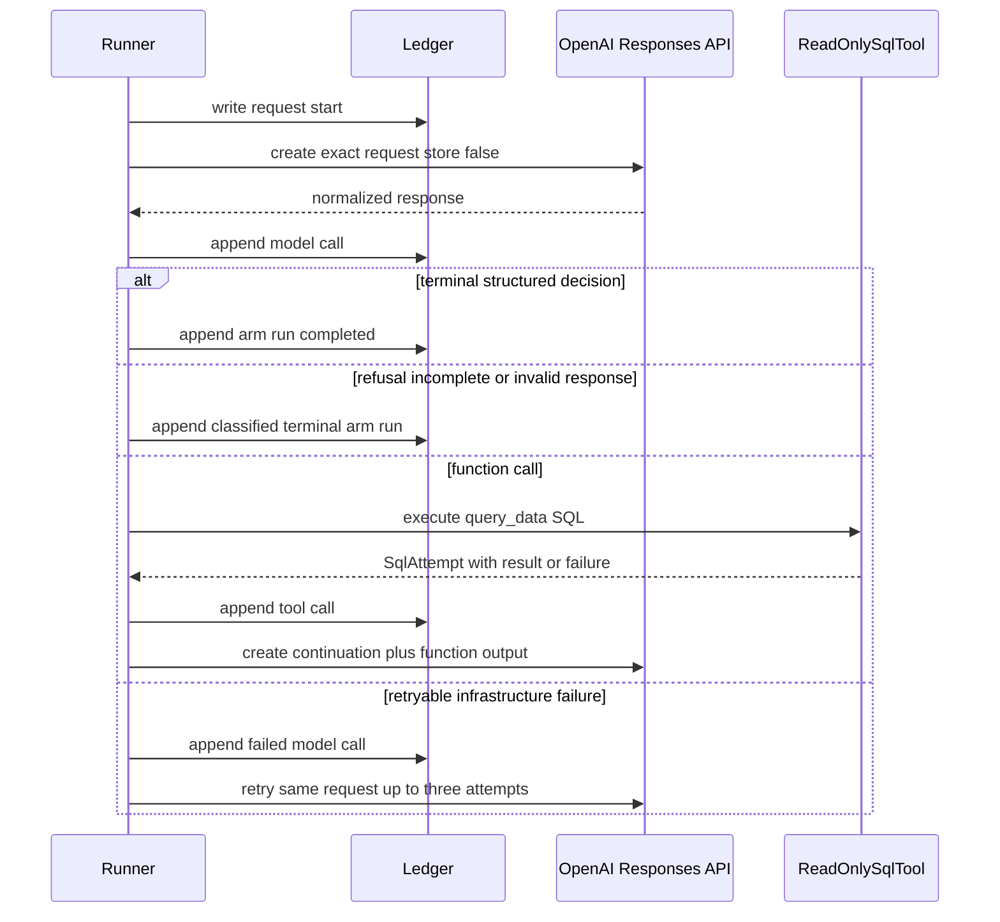
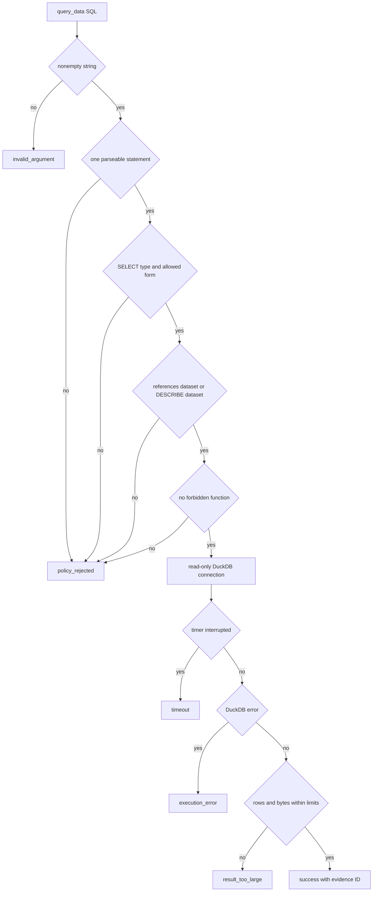

# OpenAI Execution and Bounded SQL Discovery

The Data Access experiment separates provider interaction from experiment control. `ResponsesClient` is the small injected provider boundary: production uses `OpenAIResponsesClient`, while `ScriptedResponsesClient` supplies deterministic offline replies or exceptions. The runner owns retries, limits, transcript construction, and append-only artifacts rather than relying on provider-side conversation state. This makes a run inspectable and testable without an API key, while retaining an OpenAI adapter for live execution.

The three treatment arms have a deliberately narrow difference. `dsx_packet` receives only the packet and no tools; `full_data` receives a descriptor for the DuckDB relation `dataset` and exactly `query_data`; `packet_and_full_data` receives both. `validate_fairness` hashes the common model/task projection and fails if any model, prompt, output-token, reasoning, service-tier, schema, or evidence-protocol setting drifts outside that treatment boundary. Arm order is seeded and randomized for each repetition attempt.

## Provider boundary and response normalization

`OpenAIResponsesClient.create` converts a normalized `ResponsesRequest` to a non-streaming `client.responses.create` request. It always sends `store=False` and `parallel_tool_calls=False`; the request contract rejects either setting if enabled. It supplies the strict JSON-schema terminal format generated by `provider_decision_schema`, and conditionally passes the one tool, reasoning effort, and service tier.

The adapter normalizes SDK output into `ResponsesEnvelope` rather than allowing SDK types into execution state. It preserves a canonical raw envelope, response metadata and service tier, usage counters (including cached input and reasoning tokens), function calls, structured terminal decision, refusal, incomplete reason, and provider error. Function-call arguments are canonicalized as JSON objects; malformed JSON becomes an invalid-arguments object, which the tool loop records as a failed discovery attempt rather than executing. For stateless continuation, every provider output item is replayed as input after SDK-only null fields are removed, because null optional output fields are not valid in the Responses input union.

This shows the stateless Responses tool loop: each continuation carries recorded response output plus function output, rather than referencing server-side conversation state.

### Failure classification, retries, and limits

A thrown `ModelTransportError`, `TimeoutError`, `ConnectionError`, or OpenAI `APIConnectionError`/`APITimeoutError` becomes `transport_error`; `ModelProviderError` and OpenAI `APIStatusError` become `provider_error`. Provider envelopes with `error`, `failed`, or `error` status are likewise provider errors. Refusals are `refused`; incomplete or canceled envelopes are `incomplete`; a non-terminal response without a schema-valid `DataAccessDecision` is `invalid_output`.

Infrastructure failures retry the *same exact request* up to three provider attempts with exponential waits of one then two seconds. Exhaustion makes the repetition attempt an infrastructure failure, so the runner starts one fresh attempt and reruns every arm; a repetition is `infra_incomplete` only after both attempts exhaust infrastructure retries. Refusals, incomplete responses, invalid output, and SQL-policy failures are observable outcomes, not grounds to restart the experimental repetition.

The runner also enforces per-arm wall-clock, model-call, and SQL-attempt caps. Defaults from `ExperimentLimits` are 600 seconds, 16 model calls, 12 SQL attempts, a 10-second SQL timeout, 1,000 rows, and 64 KiB of canonical result data. A call cap can prevent a provider retry and yields `model_call_limit`; reaching the SQL cap during function calls yields `tool_call_limit`.

## Safe `query_data` discovery

`query_data` is a strict function with one required `sql` string and no extra properties. It is only exposed in full-data-capable arms. `ReadOnlySqlTool` opens a fresh DuckDB connection for each query using `read_only=True` and `enable_external_access=false`, starts an interrupt timer, and always cancels the timer and closes the connection.

The SQL validator is intentionally a small discovery language rather than a general SQL sandbox. It parses with DuckDB, permits exactly one statement, requires DuckDB's `SELECT` statement type, and allows only `SELECT`/`WITH` queries that reference `dataset` through `FROM` or `JOIN`, plus exactly `DESCRIBE dataset`. It rejects mutating and non-SELECT statements, multiple statements, queries detached from the dataset relation, and named external readers, database scanners, metadata/settings functions, and `duckdb_`/`pragma_` function families. Tokenization ignores strings and comments so ordinary literals, comments, and quoted dataset column names do not accidentally trigger the policy.

This flowchart distinguishes invalid function arguments, policy rejection, execution failure, timeout, oversized results, and successful evidence; all are persisted as typed `SqlAttempt` outcomes.

### Result bounds and immutable SQL evidence

The tool fetches `max_rows + 1` rows so it can reject rather than silently truncate an oversized result. It serializes values into canonical JSON-compatible form, calculates the canonical byte count for columns and rows, and rejects results above `max_result_bytes`. A successful result stores column names/types, rows, byte count, and a canonical result digest. Its `evidence_id` is deterministic from the normalized SQL statement and result digest, while its `attempt_id` additionally includes the execution ordinal; identical results can therefore share evidence while separate calls remain distinct ledger events.

Each tool loop result is returned to the model as a `function_call_output` carrying the entire serialized `SqlAttempt`, including a failure. The runner appends ordered tool-call ledgers and counts every non-success attempt as a failed discovery attempt. Unknown function names are converted to an invalid SQL argument attempt rather than dispatching arbitrary code.

## Claim evidence, evaluation, and replay

Terminal decisions may contain typed factual claims and references. The available evidence type depends on the arm: packet-only permits `packet_json_pointer`, full-data permits `tool_call`, and the combined arm permits either. A tool reference resolves only when its ID names a successful recorded SQL result. The evaluator does more than check ID existence: for shipped predicates it requires the SQL/result shape to prove the asserted fact, such as one `row_count` row, a target-filtered labeled class aggregate, or the specified aliases for missingness, uniqueness, likely-ID, and exclusion facts. It compares the assertion with the case oracle evaluated against the frozen dataset and classifies each claim as supported, unsupported, contradicted, or unverifiable.

Cited SQL evidence is replayed during objective reporting. `replay_sql_evidence` reruns each unique cited successful query against the manifest's committed database using the same configured limits and compares canonical result digests. The outcome is `matched`, `mismatched`, or `replay_failed`; unknown or non-success evidence IDs produce no replay record. This detects a changed database/result even when a decision still cites a syntactically valid historical ID.

## Audit trail and operations

Before each provider call, the runner exclusively creates a `model_requests/<model-call>-<provider-attempt>.json` artifact containing the exact request. It then writes the model-call ledger, individual tool-call ledgers, arm specification, and final arm run using exclusive creation. The persisted contracts enforce contiguous model and tool numbering, usage equal to the sum of recorded response usage, completed-only decisions, and a `failed_discovery_attempts` count equal to non-success SQL ledger entries.

`validate_arm_transcript` reconstructs the initial arm input and every stateless continuation from the frozen specification, raw provider outputs, and recorded function results. It rejects treatment crossing, common-projection drift, missing/extra or reordered tool calls, request tampering, malformed continuation output, retry-number violations, excess calls, usage mismatch, and terminal outcomes inconsistent with the ledger. Run validation should additionally compare the on-disk pre-call request artifacts with the request objects in model-call ledgers.

The `dsx experiments data-access run` command requires `OPENAI_API_KEY`, validates prepared input commitments, writes a run manifest with the input-manifest digest and order seed, then lazily instantiates `OpenAIResponsesClient`. The paid live smoke test is deliberately excluded from the ordinary offline gate: it requires `DATA_ACCESS_LIVE=1`, `OPENAI_API_KEY`, and `MODEL_ID`, runs one small three-arm repetition, and checks that request/call/run artifacts exist.

## Focused verification

- `tests/experiments/data_access/test_execution.py` exercises arm fairness, stateless continuation construction, strict schema routing, append-only pre-call evidence, all principal terminal and retry paths, normalization, request options, and transcript-tamper rejection.
- `tests/experiments/data_access/test_sql_tool.py` covers the narrow SQL grammar, read-only and external/metadata restrictions, literals/comments/keyword-named columns, typed failure outcomes, row and byte limits, and timer-interrupt timeout handling.
- `tests/experiments/data_access/test_evaluation.py` verifies predicate-specific evidence shapes and evaluator classifications, as well as replay mismatch and replay-failure reporting.
- `tests/experiments/data_access/test_live.py` is opt-in contract smoke coverage against the real Responses API; it should be run only with explicit credentials and paid-run consent.
