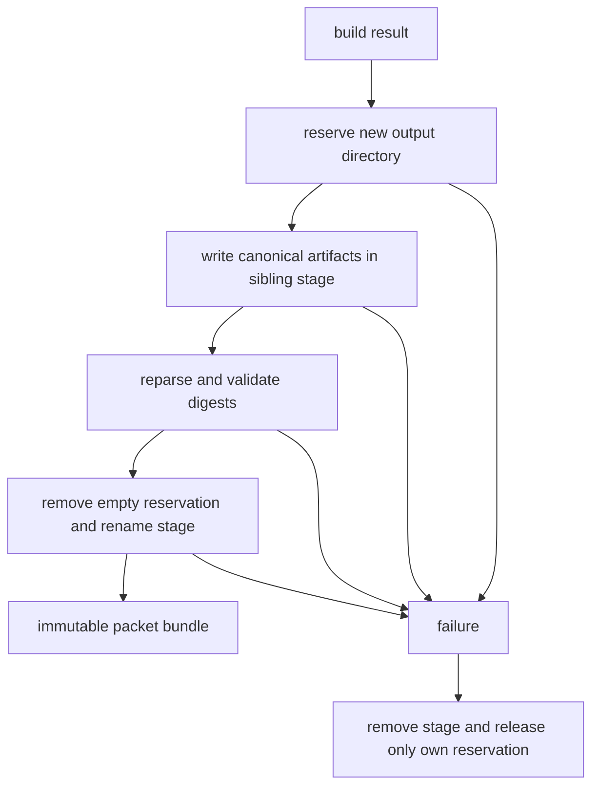
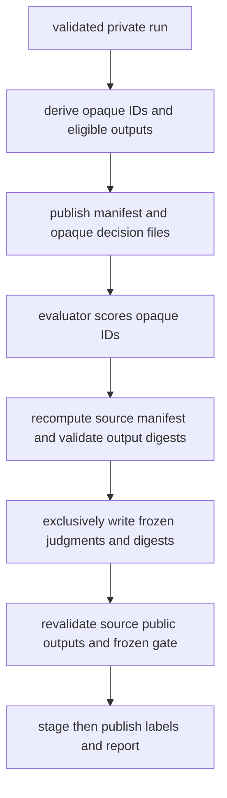

# Evidence Integrity, Immutability, and Blind Review

This repository treats experimental inputs, requests, execution records, judgments, and reports as evidence-bearing artifacts—not operator memory. The controls apply at two levels:

- **Packet bundles** are immutable build outputs, published only after validation.
- **Context Lift** is a two-arm, fixed synthetic-case comparison in which `context.profile_packet` is the sole permitted request difference.
- **Data Access** is an independent three-arm comparison: `dsx_packet`, `full_data`, and `packet_and_full_data`. It commits prepared data, pricing, arm specifications, and provider/tool transcripts.

The experiments are separate protocols and their artifacts and conclusions must not be reused or reinterpreted across the boundary. See [Building packet bundles](/openwiki/workflows/building-packet-bundles.md), [Context Lift](/openwiki/workflows/context-lift-experiment.md), and [Data Access](/openwiki/workflows/data-access-experiment.md) for workflow-specific details.

## Core operational invariants

| Invariant | Why it matters | Enforcement pattern |
| --- | --- | --- |
| A destination is exclusive | A later invocation must not overwrite, resume, or silently blend prior evidence. | Create-only files/directories; staged output is published only to a vacant destination. |
| A public result derives from a private commitment | A reviewer must not judge a substituted output. | Digests, deterministic reconstruction, and equality checks at freeze and reveal. |
| Requests exist before live calls | A crash or provider dispute must not leave an unrecorded request. | Persist exact request-start artifacts before crossing the provider boundary. |
| History is append-only | Retries and failures are evidence, rather than erasable implementation noise. | One immutable outcome/ledger record per request or tool call; summaries reconcile them. |
| Infrastructure retries do not create mixed comparison units | A successful arm from a failed pair/repetition cannot be combined with a fresh opposite arm. | Retry the exact request locally, then restart the complete pair/repetition on exhaustion. |
| Labels remain unavailable until scoring is committed | Knowledge of treatment can bias qualitative judgments. | Opaque IDs and output-only public bundles; freeze is a prerequisite for reveal. |

## Immutable artifact lifecycle

Packet construction uses an exclusive reservation followed by sibling staging. `write_packet_bundle` writes canonical JSON to a temporary directory, reparses it, verifies packet/build-record digest linkage (and an optional transformation manifest), rejects unexpected files, then renames the validated stage into the reserved destination. Failure removes the temporary directory and attempts to release the reservation without deleting a competing occupant. The source dataset is not copied into the bundle.

This shows the packet-bundle publication lifecycle. Validation happens before the final directory becomes visible.

The same principle protects blind exports and reveal output. Both Context Lift and Data Access stage a manifest and opaque outputs, validate the staged artifacts, and publish through an exclusive directory symlink. The Context Lift implementation additionally detects the case where publication succeeded but the publisher then raised, so cleanup does not turn a committed stage into a dangling reference.

## Canonical commitments and preflight verification

### Context Lift request equality

`generate` produces `case.json`, `packet.json`, `request_configuration.json`, and `rendered_requests.json`. It renders both complete provider requests and proves the controlled delta by removing only `context.profile_packet`, comparing the remaining canonical JSON projections, and hashing them. This is structural: an absent packet path does not count as an explicit `null`. Canonical request JSON is sorted compact UTF-8 JSON and disallows non-finite floats.

Before `run` constructs a client, it loads the persisted contracts through Pydantic, regenerates the seeded case and candidate packet, re-renders requests, and requires equality with the stored render. It then writes `run_manifest.json` before client construction. The manifest binds the case digest, packet version, model, generation and ordering seeds, intended pair identities/order seeds, both full request digests, and their common-projection digest.

### Data Access input and arm commitments

`prepare` exclusively materializes a DuckDB database and writes a `DataAccessManifest` that commits the opaque packet, source and logical materialized dataset digests, model/task configuration, frozen pricing, limits, and query-tool schema. `run` rechecks the source-file and materialized-data digests, creates the exclusive run root, and writes a `DataAccessRunManifest` whose digest must match its embedded input manifest before lazy construction of the OpenAI client.

Data Access arm specifications make treatment capability explicit. `dsx_packet` has packet context and no tools; `full_data` has a dataset descriptor and exactly `query_data`; `packet_and_full_data` has both. Their common projection includes model, prompt, task, output cap, reasoning/service settings, response schema, and evidence protocol. `validate_fairness` hashes that projection and fails if a non-treatment setting differs.

## Append-only ledgers, reconciliation, and retries

Context Lift writes an attempt's `rendered_requests.json` and `attempt_start.json` before the first request. Each terminal request produces an immutable `outcomes/NN-ARM.json`; an attempt summary follows, and finally a pair summary. Transport and provider errors get up to three requests for that arm, with one- and two-second backoff. On exhaustion, the runner starts at most one *fresh pair attempt* and reruns both arms; after a second exhaustion the pair is `infra_incomplete`. Refusals, provider-declared incompleteness, and invalid structured responses are behavior-visible terminal outcomes and are not retried as infrastructure faults.

Data Access follows the equivalent boundary at finer granularity. Before every provider call it writes `ModelRequestStart` under `model_requests/`; it then appends model-call records and, where applicable, ordered tool-call records. The run validator reconstructs expected repetitions, deterministic order seeds, attempt IDs, arm specs, and transcript shape; it rejects unexpected, missing, reordered, or divergent files, and verifies that persisted pre-call requests match later model-call records. It also validates prepared data again before blind use.

Both protocols therefore fail closed on ledger tampering rather than trying to infer missing history. In Context Lift, pre-export/reveal validation reconciles exactly the manifest-declared summaries with standalone starts, renders, and every outcome file while recomputing request and common-projection digests. In Data Access, validation also checks contiguous call numbering, transcript continuation, tool records, and arm/repetition identity.

## Mask, freeze, then reveal

This gate prevents official arm assignment from being released before a complete, source-bound judgment set is frozen.

Blind export considers only a complete final comparison unit. Context Lift exports both decisions only when the final fresh pair attempt completed with parsed decisions for both arms; Data Access exports all three only when the final repetition attempt completed all arms. Other outcomes are excluded with non-identifying reason/count information. Opaque identifiers are fixed-length SHA-256-derived values based on the blind protocol version, public seed, repetition/pair identity, and arm; outputs are first sorted by opaque ID and then deterministically shuffled from the seed.

The public bundles deliberately omit treatment labels and source locators. Context Lift publishes the manifest, output digests, exclusions, and opaque decision files, but no pair ID, request digest, or official arm. Data Access exports public decision fields and factual claim *statements* but excludes packet contents, data, SQL, evidence pointers, tool results, operational metrics, usage, cost, automatic scoring, and repetition identity.

To freeze, every manifest ID must have exactly one judgment and strict integer scores in the permitted range. The implementation canonicalizes judgments to manifest order and commits both the manifest digest and judgment digest in exclusive `frozen_judgments.json`. Reveal recomputes the manifest from the verified private run, validates every public output and the frozen digests, reconstructs the official mapping, and stages/validates the complete reveal directory before publishing it. This repeated source derivation prevents a coordinated edit to a public manifest and freeze file from authorizing changed labels.

Context Lift reports comparative ratings, packet-uptake diagnostics, and arm-guess results separately. Packet-only diagnostics are not included in the comparative score because they test access deliberately denied to the packet-off arm. Data Access joins frozen qualitative scores with its private objective and operational report only at reveal.

## Access, credentials, and cost operations

The blind seed is public for reproducibility, not a confidentiality secret. Anyone who has both that seed and the labeled private run can recompute opaque assignments. Give evaluators only the blind bundle until freezing completes, and keep run roots private.

Live `run` commands require `OPENAI_API_KEY`; Context Lift optionally obtains `MODEL_ID` from `.env`, without overwriting shell-provided variables. The Context Lift OpenAI adapter uses non-streaming structured Responses parsing with `store=False`. Data Access similarly uses non-streaming requests that require `store=False` and sequential tools; its client is imported only after local preflight succeeds, preserving offline preparation and tests. Treat live execution as paid work: Data Access commits a pricing snapshot in prepared input, records provider usage, and calculates inference and optional packet-build/amortized costs in the post-reveal report. These operational measurements are intentionally private during blind judgment.

For the Data Access discovery boundary and SQL replay semantics, see [OpenAI Execution and Bounded SQL Discovery](/openwiki/integrations/openai-and-safe-sql-discovery.md).

## Failure handling and safe extension points

- **Do not add an arm capability as an incidental prompt change.** Add it to `ArmExecutionSpec`, define its allowed context/tools, and update the common-projection/fairness contract so it is either explicitly treatment-specific or rejected as drift.
- **Do not loosen public artifacts for convenience.** Any newly exposed field can leak treatment or private evidence. Extend `PublicBlindOutput` deliberately and include it in digest-bound manifests and source reconstruction.
- **Do not resume a partially written run root.** Existing destinations are evidence of a prior invocation or a failure requiring investigation; use a new destination for a clean attempt.
- **Do not collapse failures into retries.** Preserve provider/transport errors separately from refusals, incomplete responses, invalid output, policy failures, and caps; only infrastructure exhaustion triggers a fresh comparison attempt.
- **Preserve canonical serialization and validation at every new persistence boundary.** A digest is meaningful only if both its serialized value and its source reconstruction are validated.

## Focused verification

`tests/builders/test_persist.py` verifies exclusive packet destinations, no dataset copying, reparse/digest/manifest validation, cleanup after staging or rename failure, and refusal to replace occupied outputs. `tests/experiments/context_lift/test_blind.py` exercises final-attempt eligibility, opaque/public-only exports, seeded permutations and collision safety, freeze completeness/canonicality, tamper rejection, retry-ledger invariants, and staged reveal failures. `tests/experiments/data_access/test_blind.py` verifies three-arm eligibility, strict private-run reconciliation—including pre-call request artifacts—and tamper/exclusive-reveal controls. `tests/experiments/data_access/test_execution.py` establishes that request artifacts exist before a client can return, validates fairness and fresh-repetition retries, and covers the stateless tool-loop contract.

Related operational guidance: [Verification strategy](/openwiki/testing/verification-strategy.md), [Packet bundles](/openwiki/workflows/building-packet-bundles.md), [Context Lift](/openwiki/workflows/context-lift-experiment.md), and [Data Access](/openwiki/workflows/data-access-experiment.md).
