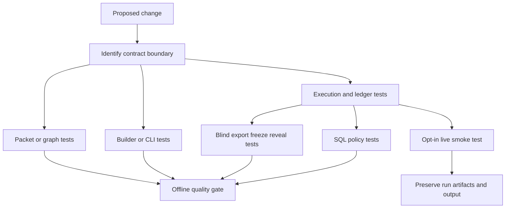
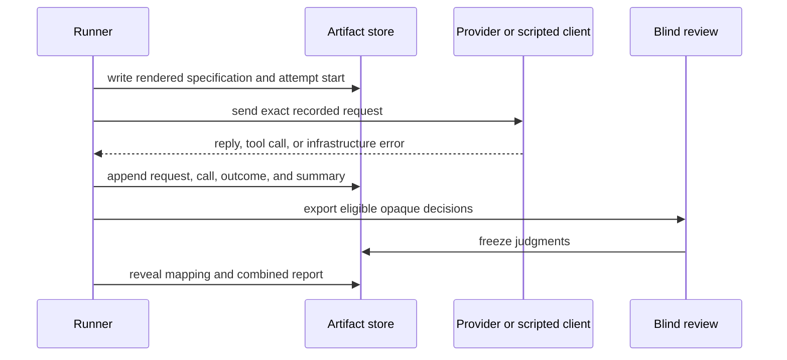

# Verification Strategy and Test Boundaries

Verification in this repository is layered around observable contracts and evidence integrity, not merely line coverage. Start at the narrowest layer that proves a change, keep the complete failure output, and expand only when the change crosses a boundary. Source and tests define the contract; a brief's unresolved questions are gaps to investigate rather than requirements to implement.

The normal gate is deliberately offline. It excludes `live` tests, collects branch coverage for the product and both experiments, requires 100% coverage, and follows with linting, strict type checking, and a package build:

```bash
uv run pytest -m "not live" \
  --cov=dsx.packet \
  --cov=dsx.pipeline \
  --cov=dsx.builders \
  --cov=dsx.experiments.context_lift \
  --cov=dsx.experiments.data_access \
  --cov-branch --cov-fail-under=100
uv run ruff check .
uv run mypy src
uv build
```

`pyproject.toml` defines the `live` marker, strict `mypy` configuration for `src`, and Ruff's Python 3.12 target and selected lint families. The full gate is appropriate before merging a cross-cutting change; do not substitute it for a focused reproducer while debugging.

## Layer map and selection



This shows the escalation path: test the changed local contract first, then test its owning boundary, and only use a live provider when the real Responses API contract itself is in scope.

| Change boundary | Focused offline evidence | What it protects |
| --- | --- | --- |
| Packet envelope or task projection | `tests/packet/test_models.py`, `tests/packet/test_tasks.py` | Immutable, strict packet data; canonical commitments; task completeness and provenance binding. |
| Transformation manifest or traversal | `tests/pipeline/test_graph.py` | Valid DAG construction, deterministic ordering, lineage and graph-query semantics. |
| Packet build or package isolation | `tests/builders/test_cli.py`, `tests/builders/test_isolation.py` | CSV/Parquet CLI behavior, exclusive output and clean errors; no experiment dependency in product packages. |
| Context Lift rendering, runner, or CLI | `tests/experiments/context_lift/test_runner.py` plus the pertinent render/CLI test | Sequential paired execution, retry classification, append-only evidence, and offline provider substitution. |
| Data Access execution or preparation | `tests/experiments/data_access/test_execution.py`, `test_prepare.py`, `test_cli.py` | Narrow arm treatment, fairness, exact request persistence, committed inputs, and transcript reconstruction. |
| Blind reconciliation or reports | `tests/experiments/*/test_blind.py` | Opaque exports, eligibility rules, frozen judgments, tamper detection, and controlled reveal. |
| Full-data discovery policy | `tests/experiments/data_access/test_sql_tool.py` | Read-only single-statement access to `dataset`, forbidden-operation rejection, and bounded outputs. |
| OpenAI provider adapter | `tests/experiments/data_access/test_live.py` | One opt-in paid end-to-end three-arm repetition against the real provider. |

## Contract and graph tests

Packet tests should be the first stop for changes to `DsxPacket`, `PacketModule`, `DsTask`, or task assembly. They establish that packet contracts are frozen and reject undeclared fields; module content is standard JSON, module IDs and module-local references/tags are unique, and the canonical serialized packet has a deterministic SHA-256 digest. Task assembly de-duplicates requested module types in declared order, selects matching source modules, binds the result to source packet and dataset digests, and fails rather than returning an incomplete task view.

Graph tests test the manifest-derived snapshot/step DAG rather than any one linear example. They cover branching, joins, multi-output steps, missing and duplicate identifiers, producer/source rules, cycles, reachability of the current snapshot, and stable topological order independent of input ordering. Retain tests for lineage and precedence when changing traversal: disconnected evaluation branches must not appear in a target's lineage, and precedence must work across reconverging branches.

Useful narrow commands:

```bash
uv run pytest tests/packet/test_models.py tests/packet/test_tasks.py -q
uv run pytest tests/pipeline/test_graph.py -q
```

## Builder and CLI boundaries

The `dsx-packet build` CLI is an integration seam: it parses an optional transformation manifest, optionally reads a prior bundle to establish revision history, builds the packet, and writes an exclusive bundle. Its CLI tests run both CSV and Parquet end to end, inspect emitted digest/revision/module information, and exercise user-facing failure categories. Failed input, an empty dataset, missing target, invalid ID, invalid manifest, or an invalid graph must exit cleanly without a traceback or a partial destination/temp directory. A build against an existing destination must fail rather than overwrite evidence.

The isolation test is architectural verification, not a style check. It parses Python imports in `builders`, `pipeline`, and `packet` and fails if any product package imports `dsx.experiments`; product behavior must remain reusable without an experiment runner.

```bash
uv run pytest tests/builders/test_cli.py tests/builders/test_isolation.py -q
```

When changing another public command, use its `CliRunner` tests to verify help text, argument parsing, credential failure before output creation, exclusivity, and persisted artifacts—not only the underlying function.

## Execution tests: reproducible experiment behavior

Both experiments isolate the provider behind a small client protocol and use scripted clients in ordinary tests. This is the primary offline substitute for network calls: it makes the request sequence, model outcome, retry path, and persistence timing deterministic.

Context Lift is a two-arm paired runner. Tests assert that arms execute sequentially in the seeded recorded order; infrastructure failures retry the exact same request with backoff of one then two seconds; and replies classify as transport/provider error, refusal, incomplete, invalid output, or completed. Only infrastructure failures trigger retries. If an attempt exhausts infrastructure retries, the runner performs one fresh paired attempt rather than mixing an old successful arm with a new one; a second exhausted attempt is terminal. The runner writes the rendered requests and attempt-start record before provider calls, preserving recovery evidence if a process crashes, and refuses collision-based overwrites.

Data Access applies the same evidence-first discipline to a three-arm comparison: packet only, full data, and packet plus full data. Its tests assert an identical common projection across arms and reject drift in a common model setting. The arm contract permits only the treatment-specific context: packet-only has no tools; full-data has a dataset descriptor and exactly `query_data`; the combined arm has both. Provider requests are non-stored and use sequential tools. Exact request artifacts are persisted before the client can return; arm transcript validation reconstructs requests and rejects altered numbering, context, output classification, or continuations.

```bash
uv run pytest tests/experiments/context_lift/test_runner.py -q
uv run pytest tests/experiments/data_access/test_execution.py -q
```

### Evidence lifecycle



This applies to both experiment families at their respective granularity: persist the comparison unit before execution, preserve typed outcomes, then blind and reveal only from the durable run evidence.

## Blind reconciliation: test the process, not just the score

Blind tests defend against accidental treatment leakage and retrospective selection. They verify that only complete comparison units are eligible: Context Lift exports the final completed retry attempt, while Data Access requires a complete three-arm repetition. Public outputs use opaque IDs and omit arm labels and private evidence locators. Freezing requires exactly one judgment per exported output and records manifest/judgment digests; reveal verifies those commitments, maps opaque IDs back to arms, and produces qualitative plus objective reporting. Tests also exercise tampering and exclusive output behavior.

Run the experiment-specific blind suite whenever changing eligibility, public serialization, judgment schema, commitment calculation, or reveal/report logic:

```bash
uv run pytest tests/experiments/context_lift/test_blind.py -q
uv run pytest tests/experiments/data_access/test_blind.py -q
```

For the operational procedure and interpretation constraints, see [Evidence Integrity and Blind Review](/openwiki/operations/evidence-integrity-and-blind-review.md).

## SQL policy tests

`ReadOnlySqlTool` is a constrained discovery boundary, not a general SQL console. Policy tests must cover adversarial inputs as well as successful aggregates. Validation permits one parsed `SELECT`/`WITH` statement that references `dataset`, or `DESCRIBE dataset`; it rejects writes, multiple statements, other relations, external readers, DuckDB metadata/settings functions, and malformed inputs. Token handling intentionally ignores strings and comments and retains quoted identifiers, so safe data containing keyword-named columns remains queryable.

Execution tests also assert read-only DuckDB configuration with external access disabled, typed results for policy/argument/execution/timeout failures, deterministic evidence IDs for an equivalent committed result, and row and byte caps. Keep literal/comment and keyword-column cases: simplistic keyword filtering would either create a bypass or reject valid datasets.

```bash
uv run pytest tests/experiments/data_access/test_sql_tool.py -q
```

## Live-provider boundary

Provider coverage is intentionally double opt-in and paid. `tests/experiments/data_access/test_live.py` is marked `live`; it skips unless `DATA_ACCESS_LIVE=1`, `OPENAI_API_KEY`, and `MODEL_ID` are set. It prepares a tiny local case and performs one real three-arm repetition through `OpenAIResponsesClient`, then asserts durable arm runs and request/call artifacts. It is excluded from the normal offline gate.

```bash
DATA_ACCESS_LIVE=1 OPENAI_API_KEY="$OPENAI_API_KEY" MODEL_ID="$MODEL_ID" \
  uv run pytest -m live tests/experiments/data_access/test_live.py -q
```

Use this only after relevant scripted execution tests pass and when modifying provider serialization, normalization, or another real API integration boundary. Treat the resulting run directory and full test output as evidence; do not rerun casually because it can incur cost.

## Change checklist

1. Identify the narrowest affected invariant and execute its focused test with `-q`.
2. For a boundary change, add its owner suite: CLI, graph, runner, blind workflow, or SQL policy.
3. Review failures in full; preserve the command and complete output in the change record rather than summarizing away diagnostics.
4. Run the offline quality gate before finalizing broad or release-facing work.
5. Run the live smoke test only for live-provider changes and only with explicit cost approval.

Related guidance: [System Boundaries](/openwiki/architecture/system-boundaries.md), [DSX Packets and History](/openwiki/concepts/dsx-packets-and-history.md), [Building Packet Bundles](/openwiki/workflows/building-packet-bundles.md), [Context Lift Experiment](/openwiki/workflows/context-lift-experiment.md), and [Data Access Experiment](/openwiki/workflows/data-access-experiment.md).
