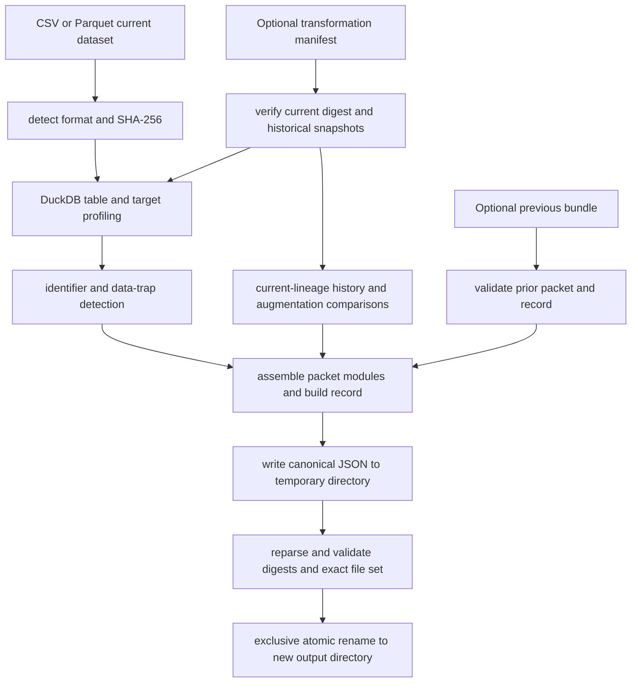

# Building Immutable Packet Bundles

`dsx-packet build` is the boundary that turns one current CSV or Parquet dataset into an inspectable DSX Packet bundle. It does **not** copy the dataset into the bundle: the packet refers to the dataset by its SHA-256 digest and basename, while the build record retains the supplied dataset path and digest. The result is a newly created directory containing canonical JSON artifacts, never an update to an existing bundle.

This workflow produces inputs for the packet/history model described in [DSX packets and history](/openwiki/concepts/dsx-packets-and-history.md). It is deliberately upstream of data-access and experiment execution: use [Data access experiment](/openwiki/workflows/data-access-experiment.md) for the later workflow, and treat the emitted evidence references according to [Evidence integrity and blind review](/openwiki/operations/evidence-integrity-and-blind-review.md).

## Entrypoints and required inputs

The installed console script maps `dsx-packet` to `dsx.builders.cli:app`. Its `build` command takes a current dataset and a **new** output directory, plus a target column and a packet identity:

```text
dsx-packet build DATASET OUTPUT --target TARGET_COLUMN --packet-id PACKET_ID [--manifest MANIFEST.json] [--previous-bundle BUNDLE]
```

For example:

```text
dsx-packet build data/train.parquet bundles/train-v2 --target label --packet-id fraud-v2 --manifest data/manifest.json --previous-bundle bundles/train-v1
```

Only `.csv` and `.parquet` suffixes are accepted for the current dataset. The CLI parses an optional manifest as a `TransformationManifest`; when present, it uses the manifest's parent directory as `snapshot_root` for relative historical paths. It loads a `--previous-bundle` before building, then supplies its validated packet digest and record to the request. User-facing validation, I/O, parsing, and collision failures are rendered as `Error: ...` with exit status 1 rather than a traceback. On success, stdout includes the output path, packet digest, dataset digest, revision, and comma-separated module IDs.

Library callers use `PacketBuildRequest`, `build_packet(request)`, and `write_packet_bundle(result, output)` directly. `build_packet` is pure with respect to the destination—it assembles `PacketBuildResult` in memory—so persistence is a separate, explicit step.



*Build control flow from dataset and optional provenance inputs through validation, module assembly, and exclusive atomic publication.*

## Profiling and evidence binding

The builder hashes the current file before profiling it. DuckDB loads CSV through `read_csv_auto` and Parquet through `read_parquet`, then derives:

- the dataset profile: row count, each column's DuckDB type, missing count, and missing rate;
- the columns profile: non-null and distinct counts and `distinct_count / row_count` uniqueness for each column; and
- the target profile: null count, non-null class counts, class rates, and majority-class rate.

An empty current dataset is rejected. The target must exist in the current dataset. Null target values are counted but excluded from class-rate denominators; class values are converted to standard JSON-compatible values and sorted deterministically. These choices make a packet's profile content reproducible for the same input bytes, even though each build record receives a new ID and timestamp.

The current dataset supplies a `sha256:<digest>` evidence reference to profile and risk modules. A manifest, when accepted, supplies `manifest:<digest>` evidence to history-derived traps. For target comparisons that successfully profile historical snapshots, the target-profile module also includes the relevant historical snapshot digests.

## Optional manifest and historical snapshots

A manifest changes the meaning of the current snapshot from the default `current` ID to `manifest.current_snapshot_id`. Before profiling proceeds, the builder constructs a `TransformationGraph` and requires the declared current snapshot digest to match the current dataset bytes.

Historical snapshots are assessed independently:

- A snapshot with no path, a missing path, or zero rows is reported as unavailable rather than aborting the build.
- A readable historical file must match its declared digest; a mismatch aborts the build because the declared provenance is contradicted.
- Relative snapshot paths require `snapshot_root`; absolute paths do not. The CLI supplies the manifest directory automatically.
- The history module includes only transformation steps on the graph lineage to the current snapshot, plus separate accessible and unavailable snapshot ID lists. Unrelated graph branches are omitted.

When a lineage augmentation has exactly one input and one output and both target distributions can be profiled, the target profile records its before/after distributions. Missing targets, empty historical tables, unavailable snapshots, and multi-input/output augmentation steps simply prevent that comparison; they do not fabricate a result.

## Modules and warning detectors

Every packet contains these modules in stable order: `dataset-profile`, `column-profile`, `target-profile`, `data-traps`, and `feature-risks`. With a manifest, `transformation-history` is inserted after `target-profile`. Each module has a fixed module type and versioned schema, and the build record repeats those descriptors so consumers can identify the produced contract.

Risk detectors are deterministic and warning-only: they document conditions rather than block construction.

- **Likely identifier:** a non-target column is flagged only when it is fully populated and has one distinct value per row. It is recommended for `exclude_or_verify`; names and DuckDB types do not affect the rule.
- **Target class imbalance:** emitted for no non-null classes, one class, or a smallest-to-largest class-count ratio below `0.20` (exactly `0.20` is not flagged).
- **Augmentation before split:** emitted when an augmentation and a later split both lie on the current lineage.
- **Augmentation on evaluation:** emitted when an augmentation produces or is an ancestor of a validation or test snapshot, including evaluation branches outside the current lineage.
- **Augmentation changed target distribution:** for single-input/single-output lineage augmentation with both distributions available, emitted when the maximum absolute class-rate change is at least `0.05`; the comparison includes classes appearing on either side.

Findings carry stable IDs, referenced snapshot and step IDs where applicable, structured details, and deduplicated evidence references. The contracts reject duplicate evidence, snapshot, or step IDs within a data trap; identifier findings likewise enforce the exact-cardinality predicate and cannot name the target column.

## Revision lineage and bundle persistence

A first build record has `revision: 1` and no previous packet digest. To continue a lineage, `--previous-bundle` must name a directory containing parseable `packet.json` and `build-record.json` whose recorded digest matches the reparsed packet. The next record uses the prior revision plus one and stores that packet digest as `previous_packet_digest`. Request validation requires the prior record and digest together and requires them to agree; it does not require the new `packet_id` to equal the prior packet ID.

The output directory is an immutable publication boundary:

1. Its parent must already exist and be a directory.
2. The writer first creates `OUTPUT` with `mkdir` as an exclusive reservation; any existing file or even empty directory fails with `FileExistsError` and is untouched.
3. It writes canonical `packet.json` and `build-record.json` to a sibling temporary directory, adding canonical `manifest.json` only when a manifest was supplied.
4. It reparses the staged JSON and verifies the packet digest, build-record linkage, manifest equality/digest, and exact expected file set.
5. It removes the empty reservation and renames the staged directory into place. On errors it removes its temporary directory and, when still owned and empty, the reservation.

Thus a successful bundle contains either `packet.json` and `build-record.json`, or those two files plus `manifest.json`; raw CSV and Parquet input is intentionally absent. The brief reservation-removal interval is required for POSIX directory rename, so callers should still treat output paths as exclusively allocated rather than as a concurrent shared destination.

## Failure handling and safe operation

Fail early on a missing/unreadable dataset, unsupported suffix, malformed/empty table, missing target, invalid manifest, mismatch between the current file and its declared snapshot digest, tampered readable historical snapshot, invalid previous bundle, or existing destination. Do not retry against the same output path after a successful run—choose a new bundle directory. A failed staged write/validation/rename cleans the temporary directory and normally frees the reservation; if another actor fills the reservation during failure handling, cleanup deliberately does not delete that actor's contents.

For broader ownership boundaries, see [System boundaries](/openwiki/architecture/system-boundaries.md). The test strategy is summarized in [Verification strategy](/openwiki/testing/verification-strategy.md).

## Focused verification coverage

The builder tests cover the important behavioral seams rather than just serialization: CSV/Parquet semantic profile equivalence; empty, malformed, unsupported, and missing inputs; target null treatment; manifest digest enforcement; relative and absolute historical paths; inaccessible versus tampered history; lineage-only history; augmentation comparison skip rules; all trap thresholds; exact identifier detection; prior-bundle tampering; revision increments; CLI error presentation; destination collision refusal; staged-artifact revalidation; and cleanup after injected validation, temporary-directory, or rename failures.
