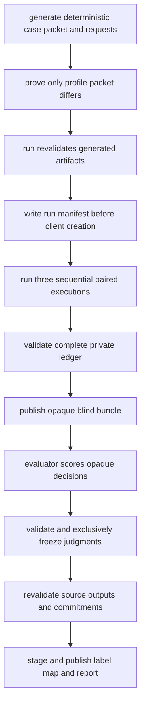
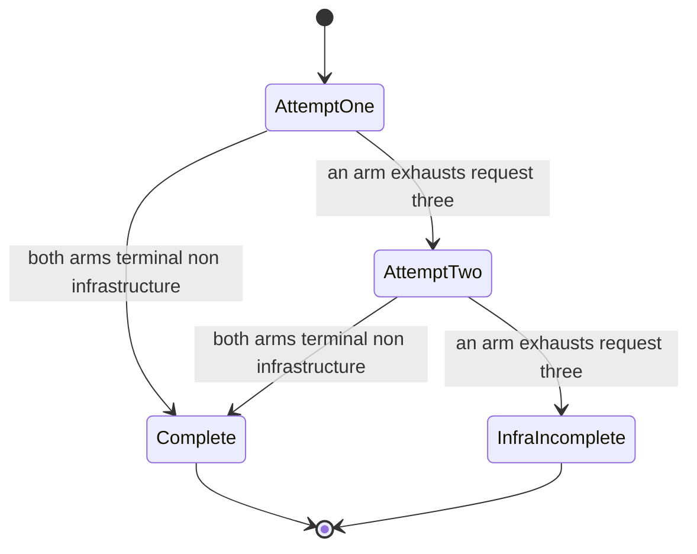

# Context Lift Controlled Comparison Workflow

Context Lift is a **frozen, one-case information-availability pilot**, not a general product evaluation. It compares two otherwise identical structured model requests: `packet_on` receives a hand-authored evidence `Packet`; `packet_off` explicitly receives `context.profile_packet = null`. The synthetic case has 5,000 rows, a fixed 5% manual-review objective, and a deterministic default seed. The protocol produces a durable ledger so that request equality, retries, eligibility, reviewer scores, and later label assignment are inspectable evidence rather than operator assertions.

The pilot does **not** give the packet-off arm the underlying rows or another discovery mechanism. Its results can describe this one execution and case; they cannot establish statistical significance, general DSX superiority, or a causal advantage over an agent with equivalent data-discovery access. That latter question belongs to the separate Data Access protocol.

## Scope, roles, and boundaries

| Role or boundary | Responsibility |
| --- | --- |
| Operator | Generates inputs, runs the paid provider calls, retains the private run root, exports the blind bundle, and performs reveal only after a freeze. |
| Model client | Receives the recorded `ModelRequest` through the `ModelClient` protocol. The production `OpenAIModelClient` uses structured Responses parsing with SDK retries disabled and `store=False`. |
| Evaluator | Receives only the blind bundle and scoring rubric; supplies one complete judgment for each opaque output. |
| Private run root | Holds pair IDs, arm labels, rendered requests, outcomes, and the information needed to reconstruct official assignments. Keep it unavailable to the evaluator. |
| Public blind bundle | Holds a non-identifying manifest and opaque decision files. It deliberately omits pair identity, request digests, official arm labels, and packet payloads. |

The public blind seed is reproducibility material, **not** a secret. An evaluator who also has the labeled private run can recompute opaque identifiers and recover the assignment; access separation is therefore a protocol control.

## Generation-to-reveal workflow



This is the evidence flow: the provider is crossed only after a rendered request pair and run commitments exist; reveal is possible only after the source, public outputs, and frozen judgments all validate again.

## 1. Generate deterministic inputs and prove the sole delta

Use the public entrypoint `dsx-context-lift` (the architecture documentation notes `dsx-pilot` as a retained compatibility alias). Generation is local: it records a model identifier but does not contact a provider.

```bash
uv run dsx-context-lift generate pilot-generated --model offline-example
```

Generation creates a new directory and writes four strict Pydantic contracts:

```text
case.json
packet.json
request_configuration.json
rendered_requests.json
```

`case.json` contains the seeded synthetic task and rows. `packet.json` is the fixed candidate packet: among other facts, it records the 5,000-row shape, 4,900/100 class counts, 0.98 majority baseline, likely identifier field, missingness, metric and split guidance, and limitations. `request_configuration.json` fixes the shared model identifier, system prompt, and response schema name. `rendered_requests.json` stores both complete `ModelRequest` objects and their commitments.

`render_requests` constructs the two requests from the same shared fields. `prove_controlled_delta` removes only `context.profile_packet` from both JSON projections, compares every remaining structural path, and returns a SHA-256 common-projection digest. It rejects missing packet paths as well as value drift: packet-off must explicitly contain `None`, packet-on must contain the expected packet, and any difference in model identifier, prompts, schema name, context shape, or a future shared field fails the proof. Full-request digests remain different because the packet itself differs.

Canonical requests are compact sorted-key UTF-8 JSON with `allow_nan=False`; `NaN`, positive infinity, and negative infinity fail rather than producing ambiguous non-standard JSON. A packet over 32 KiB causes a warning but is not rejected.

For the default seed, the case digest is fixed:

```text
57eec293b8b511ac9c1cf244eded3dddd483f375b47435bd92db67dcc5af5c9a
```

### Configuration and preparation

Install the project, create a local credential file if desired, and generate a new live input directory with the intended exact model configuration:

```bash
uv sync --all-groups
uv run dsx-context-lift --help
uv run dsx-context-lift generate pilot-live-inputs
```

`generate` obtains the model from `--model` or `MODEL_ID`. The CLI loads a simple `.env` in the current working directory without overriding already-set environment variables. Put `MODEL_ID` and `OPENAI_API_KEY` in process environment or a Git-ignored `.env`; never put the API key in a command argument or an experiment artifact.

All output destinations are create-only. Treat a pre-existing generated directory as evidence to inspect, not a directory to overwrite.

## 2. Run the three committed live pairs

```bash
uv run dsx-context-lift run pilot-live-inputs pilot-run --order-seed 731
```

Before constructing `OpenAIModelClient`, `run` parses the four generated contracts, regenerates the case from its recorded seed, checks the default frozen digest where applicable, requires the candidate packet to match exactly, re-renders the request pair, and requires equality with the persisted render. It also requires a nonempty `OPENAI_API_KEY` before creating the new run root.

The root begins with `run_manifest.json`. It commits the case digest, packet version, model, generation and base-order seeds, exactly three deterministic pair IDs and order seeds, both request digests, the shared-projection digest, and the fixed claim label. Pair identities and their order seeds are deterministically derived from the committed case digest and base order seed, so later validation can reject missing, extra, reordered, or substituted pairs.

The runner executes arms **sequentially** in the seeded arm order, not in parallel. Before its first call in each pair attempt, it writes that attempt's `rendered_requests.json` and `attempt_start.json`; after each request it writes a separate `outcomes/NN-ARM.json`. It then appends `attempt_summary.json` and one terminal `pair_summary.json`. Contract models are frozen, forbid undeclared fields, and enforce matching identity/digest and ordered ledger invariants.

### Pair retry lifecycle



This shows a pair-level retry. Each attempt runs its arms in recorded sequence; the runner stops that attempt as soon as an arm exhausts infrastructure retries.

Within an arm, only `transport_error` and `provider_error` retry, at most three requests, with one- then two-second backoff. A retry reuses the exact rendered request. `refused`, `incomplete`, `invalid_output`, and `completed` are terminal observable results, so they do not get relabeled as transient infrastructure noise. Provider error classification has precedence over other response fields; refusal then takes precedence over incompleteness, followed by invalid structured output and completion.

If an arm exhausts request three, the attempt is `infra_failure`. The runner creates one fresh pair attempt with a new attempt ID and executes both arms again; it never combines a successful arm from the invalidated attempt with a fresh opposite arm. A second exhausted pair attempt becomes the honest terminal `infra_incomplete`. The CLI continues to the other intended pairs after such a terminal result.

A crash or unexpected exception leaves already-written artifacts in place. There is no resume/overwrite path for a run root: an attempt-ID collision and an existing terminal pair summary fail rather than replace prior evidence. Start a clean run at a new destination after preserving the interrupted root for investigation.

## 3. Validate the private evidence before blind export

Both `judge` and `reveal` run private-ledger reconciliation before crossing the blind boundary. Validation requires exactly the three manifest-declared pair summaries and re-derives pair IDs and arm-order seeds. For each recorded attempt it checks the standalone start and summary, rendered request pair, all expected per-request outcome files, model/task fields, full request digests, common projection proof, and manifest commitments.

This prevents a public result from silently relying on missing, added, reordered, rewritten, or request-divergent evidence. A `PairSummary` also permits no more than two attempts, contiguous request numbers beginning at one, no arm interleaving, and only the last executed arm to exhaust infrastructure retries. A complete attempt has both arms with non-infrastructure terminal outcomes; eligibility for judging is stricter still: **both final-arm outcomes must be `completed` with parsed structured decisions**.

## 4. Export a blind bundle and collect judgments

Choose a public blind seed and use a new destination:

```bash
uv run dsx-context-lift judge pilot-run pilot-blind --blind-seed 991
```

For each eligible final decision, the exporter derives a 32-character lowercase hexadecimal opaque ID from the blind protocol version, blind seed, pair number, pair ID, and arm. It sorts outputs by opaque ID and applies a deterministic seed-based permutation. The staged bundle is validated before exclusive publication as a directory symlink.

The resulting bundle contains:

- `manifest.json`, with blind version, seed, shuffled opaque ID order, eligible count, non-identifying exclusion counts, and a digest commitment for every public output;
- one `<opaque_id>.json` file per eligible decision, containing only `opaque_id` and `decision`; and
- no official arm, pair ID, request digest, packet payload, or source locator.

Only final completed pairs export both arms. For example, `infra_incomplete`, refusal, incomplete response, and invalid structured output exclude the complete pair with a reason/count rather than emitting a one-sided comparison. Export collisions, unsafe opaque IDs, partial-stage writes, and occupied destinations fail closed.

Give the evaluator `pilot-blind`, the ordered IDs, and the rubric—not `pilot-run`. The evaluator must return a top-level JSON array with exactly one object per manifest ID. Every score field is a strict JSON integer from 1 through 5 (not a string, float, or boolean); `packet_guess` is `packet_off` or `packet_on` and records the evaluator's guess, not the official assignment.

## 5. Freeze the judgment set

```bash
uv run dsx-context-lift judge pilot-run pilot-blind --blind-seed 991 \
  --judgments judgments.json
```

Freezing is an exclusive gate. It recomputes the typed `BlindManifest` from the verified private run using the manifest's blind seed, requires it to equal the published manifest, validates every public output against its committed digest, and requires the judgment IDs to cover the manifest exactly once. It canonicalizes accepted judgments into manifest order and exclusively writes `frozen_judgments.json` with both the canonical manifest digest and canonical judgment-array digest.

A second freeze is refused. If validation fails, do not edit evidence to force success: preserve the bundle and run root, identify whether the source, public output, manifest, or submitted judgment set changed, and restart the affected protocol at new destinations if necessary.

## 6. Reveal labels and interpret the report

```bash
uv run dsx-context-lift reveal pilot-run pilot-blind
```

Reveal requires the frozen file and redoes the source-manifest reconstruction, frozen-digest validation, and public-output digest checks. It then reconstructs the official mapping from private source records, stages `reveal_map.json` and `revealed_report.json`, reparses both, and exclusively publishes `pilot-blind/reveal/`. A reveal directory is not overwritten or regenerated.

The report intentionally keeps three questions separate:

| Report section | Meaning |
| --- | --- |
| Comparative ratings | Mean evaluator scores for decision quality, evidence use, limitations, metric reasoning, split strategy, row-ID leakage avoidance, and overall recommendation quality. These are criteria both arms can in principle satisfy. |
| Packet-uptake diagnostics | Exact prevalence recognition, majority-baseline recognition, and citation use. These diagnose packet uptake and are not added to comparative ratings. |
| Arm-guess results | Count, evaluator-guess accuracy against the revealed arm, and mean guess confidence. |

Do not merge packet-uptake diagnostics into the fair comparison: doing so would award points for evidence deliberately unavailable to `packet_off`. A zero-eligible-output run can still freeze and reveal an explicit zero-count report; it is not evidence of a comparison result.

## Safe changes and focused verification

Context Lift is preserved as a historical protocol. Do not add product behavior, an arm capability, a prompt field, or a public output field casually:

- Any request field shared by arms belongs in `RequestConfiguration` and becomes part of the sole-delta proof; any treatment-only field must be explicit and must not be silently introduced beside `profile_packet`.
- If the response contract changes, update `AnalysisDecision`, the structured provider schema, persisted contracts, evaluator rubric, digest/reconstruction logic, and tests together.
- New public blind fields can leak treatment or private evidence. Bind them into `PublicBlindOutput`, output digests, source reconstruction, and reveal validation before publication.
- Preserve append-only artifacts and exclusive staging. Do not add a “resume,” overwrite, or unrecorded SDK retry path; the production client deliberately sets `max_retries=0` so the runner owns the recorded retry ledger.

The focused suites demonstrate these controls: render tests cover canonical serialization and structural delta failures; runner tests cover sequential seeded execution, persistence before calls, retry and classification precedence, fresh-pair behavior, crash evidence, and the OpenAI request seam; blind tests cover eligibility, opacity, freeze completeness, tamper detection, staged publication, and reveal/report separation.

```bash
uv run pytest tests/experiments/context_lift/test_render.py -q
uv run pytest tests/experiments/context_lift/test_runner.py -q
uv run pytest tests/experiments/context_lift/test_blind.py -q
uv run pytest -m "not live" --cov=dsx.experiments.context_lift --cov-branch --cov-fail-under=100
uv run ruff check .
uv run mypy src
uv build
```

## Related pages

- [System Boundaries and Dependency Direction](/openwiki/architecture/system-boundaries.md)
- [Evidence Integrity, Immutability, and Blind Review](/openwiki/operations/evidence-integrity-and-blind-review.md)
- [Verification Strategy and Test Boundaries](/openwiki/testing/verification-strategy.md)
- [Data Access experiment workflow](/openwiki/workflows/data-access-experiment.md)
