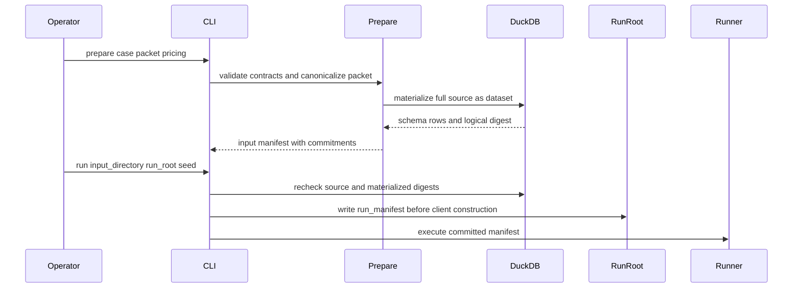
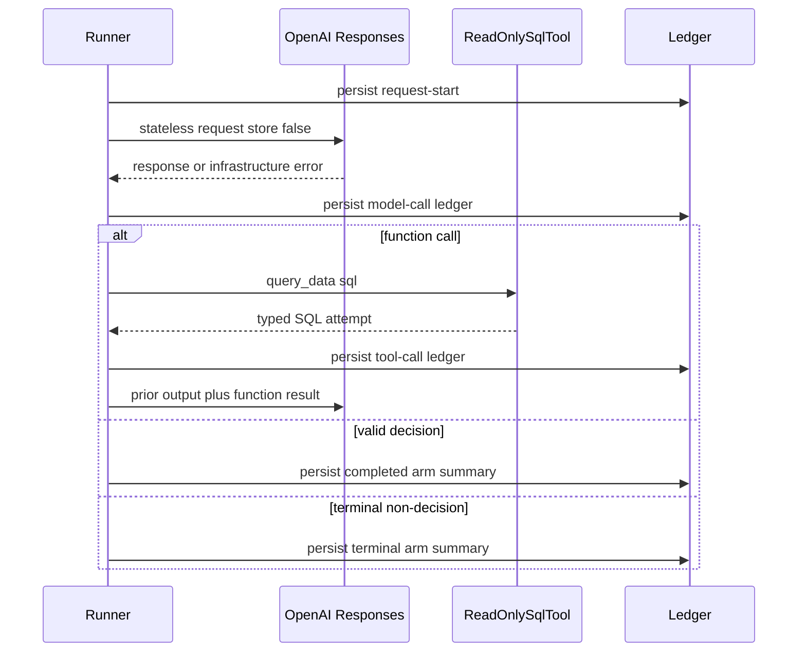
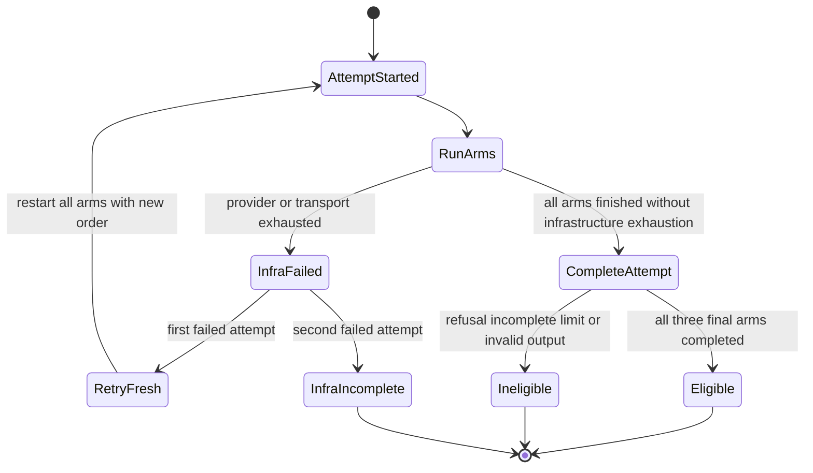

# Data Access Three-Arm Experiment Workflow

Data Access v2 is a capability-ceiling experiment, not a general benchmark claim. For one committed case, it compares fresh model executions that receive (1) an opaque DSX packet, (2) read-only discovery access to the complete prepared dataset, or (3) both. Model identifier, system and task prompts, reasoning/service settings, response schema, and output-token cap are shared commitments; the permitted treatment is only the information context and `query_data` availability. Time, tool/model calls, tokens, failures, and estimated cost are outcomes rather than quantities artificially equalized between arms.

See [Building Packet Bundles](building-packet-bundles.md) for packet production, [Evidence Integrity and Blind Review](../operations/evidence-integrity-and-blind-review.md) for the broader review boundary, and [OpenAI and Safe SQL Discovery](../integrations/openai-and-safe-sql-discovery.md) for the provider/tool integration.

## Experiment contract and entrypoints

The Typer application in `src/dsx/experiments/data_access/cli.py` is the operational boundary. It loads a project-local `.env` without overwriting environment values already supplied by the shell. `run` and `suite` require `OPENAI_API_KEY`; preparation, freezing, and the scripted test client do not.

| Command | Responsibility | Output boundary |
| --- | --- | --- |
| `prepare CASE_CONFIG DSX_PACKET OUTPUT --model MODEL --pricing PRICING` | Canonicalize a schema-agnostic packet, materialize the source into DuckDB, and write the v2 input manifest. | New immutable input directory. |
| `run INPUT_DIRECTORY RUN_ROOT --order-seed N` | Revalidate frozen inputs, commit a run manifest before constructing the live client, then execute repetitions. | New **private** run root. |
| `judge RUN_ROOT BLIND_BUNDLE --blind-seed N` | With no `--judgments`, export opaque public decisions; with it, exclusively freeze a complete judgment set. | Blind bundle, then frozen judgments. |
| `reveal RUN_ROOT BLIND_BUNDLE` | Validate private and blind commitments, map opaque IDs to arms, and publish qualitative plus objective results. | Exclusive `reveal/` directory under the bundle. |
| `freeze DATASET OUTPUT --case-id ID --target COLUMN --source-id ID --license-accepted` | Build and screen a builder-generated case for the realistic study. | Exclusive freeze directory. |
| `suite SUITE_CONFIG OUTPUT` | Prepare and execute every listed frozen case, preserving per-case status. | Exclusive suite directory and `suite-index.json`. |
| `uptake RUN_ROOT OUTPUT` | After execution, score use of packet-derived diagnostic signals for compatible DSX packets. | Exclusive `uptake.json` report. |

All persisted contracts derive from a frozen, extra-forbid base model. Versions are literal (`data-access-v2`, `data-access-run-manifest-v2`, and `data-access-blind-v2`), so absent or incompatible version fields do not silently become compatible artifacts.

## Freeze and prepare: establish the immutable inputs

A normal `prepare` case configuration identifies the task, local dataset, source format (`csv`, `parquet`, or `pilot_case_json`), target column, and oracle version. Pilot JSON must contain a non-empty top-level `rows` array. Preparation never samples: it copies every source row and column into a DuckDB table named `dataset`, confirms the target exists, and records source and canonical logical-materialization digests. The run command recomputes both digests and requires the database path to belong to the input directory before any provider client is created.

`OpaquePacket.from_value` canonicalizes arbitrary JSON and commits its SHA-256-equivalent canonical digest and byte count without interpreting its modules or provenance. Packet-build lifecycle metrics are optional, separate manifest inputs; they are not injected into packet content. Pricing is likewise an operator-supplied USD-per-million-token snapshot for input, cached-input, output, and reasoning buckets, with source and effective date. Its computed figures are estimates, not provider invoices.



This sequence shows the preparation and pre-live-execution commitment boundary.

### Realistic freeze path

`freeze` is the extension path for builder-generated packets used by the Luna realistic study. It accepts CSV or Parquet only, copies the source into the exclusive freeze directory, builds a DSX packet, and writes `packet.json`, `build-record.json`, `case.json`, `packet-build-metrics.json`, and `freeze-note.json`. Eligibility is intentionally bounded: no more than 20,000 rows, 40 columns, or 10 non-null target classes; the packet must expose the shared review-classifier task modules and at least one meaningful signal—likely identifier, target class imbalance, or material missingness (at least 5%). The note records source/license acknowledgement, file and packet digests, module IDs, and eligibility signals.

## Fair arm construction and stateless execution

`build_arm_specs` renders exactly one specification for each `Arm`:

- `dsx_packet` receives canonical `dsx_packet` JSON and no dataset descriptor or tools.
- `full_data` receives a descriptor for the complete `dataset` table and exactly the strict `query_data` function.
- `packet_and_full_data` receives both packet JSON and that same single tool.

`validate_fairness` rejects missing/duplicate arms and rejects any difference in the common projection. Arm-local validation further prevents a packet-only arm from acquiring tools or a data-bearing arm from acquiring an altered tool schema. The randomized arm order is reproducible from the run seed, but each arm begins with fresh input and its own `ReadOnlySqlTool`; no server-side Responses state is retained (`store=False`) and parallel tool calls are prohibited.

A Responses request begins with the task plus arm-specific evidence protocol. On a tool call, the runner appends the normalized prior response items and a `function_call_output` containing the typed SQL attempt, then makes a new stateless request. A valid terminal `DataAccessDecision` completes the arm; refusals, incomplete responses, invalid output, model/tool-call caps, and wall-clock caps are terminal outcomes. Every exact request is written to `model_requests/` **before** the provider call, then its response ledger is written to `model_calls/`; tool events and the arm summary are append-only siblings.



This sequence shows one arm's stateless model-and-tool loop and crash-auditable ledger ordering.

### SQL discovery safety and evidence

`query_data` accepts one non-empty SQL statement only. It allows `SELECT`, `WITH`, or `DESCRIBE dataset`, requires `SELECT`/`WITH` to reference `dataset`, opens DuckDB read-only with external access disabled, and blocks mutations, multi-statement input, catalog/settings/path disclosure functions, DuckDB/pragma functions, and external file/network readers. SQL failures remain observable typed attempts rather than disappearing: invalid argument, policy rejection, execution error, timeout, and oversized result are distinct outcomes. Defaults are 12 SQL attempts per arm, 10 seconds per query, 1,000 rows, and 64 KiB of canonical result data; the model can aggregate or paginate within those bounds.

Successful results contain columns, canonical rows, a stable evidence ID, digest, and byte count. A terminal decision has a strict provider JSON schema and can make factual claims with a predicate, asserted value, and packet JSON pointer or tool evidence ID. Evaluation only permits packet pointers in `dsx_packet`, SQL evidence in `full_data`, and either kind in the combined arm. The oracle evaluates supported predicates against the frozen database. A true claim is `supported` only when at least one cited reference also proves it; a true but inadequately evidenced claim is `unsupported`; a false claim is `contradicted`; and an unknown predicate is `unverifiable`. SQL proof checking is deliberately shape-sensitive (for example, exact aliases and aggregate forms), and cited successful SQL is replayed against the committed database and checked by result digest.

## Repetitions, retry semantics, and report eligibility

A repetition records a seeded random order of all three arms. Provider/transport failure retries the individual provider request up to three times with exponential 1-second then 2-second waits. Exhausting that budget stops the current attempt and causes at most one **fresh full repetition attempt**: all arms restart in a newly randomized order. Only infrastructure failure permits this retry. A repetition becomes `infra_incomplete` after two exhausted attempts; completed attempts can contain non-infrastructure terminal arm outcomes, but those repetitions are excluded from efficacy and blind-export eligibility unless all final arms completed with decisions.



This state diagram distinguishes provider retries within an arm from the single fresh-repetition retry and final efficacy eligibility.

Reports preserve component/total elapsed time, model/tool calls, token buckets, estimated costs, discovery failures, claim classifications, evidence-resolution and replay behavior, raw metrics, and summary statistics. Efficacy contrasts use only eligible final triplets and include `dsx_packet - full_data`, `packet_and_full_data - dsx_packet`, and `packet_and_full_data - full_data`. Operational reporting separately retains every arm run, including abandoned/retried work and infrastructure failures. Packet build timing/cost is separate and amortized at 1, 10, and 100 reuses for packet-bearing arms.

## Blind judge, reveal, and private/public boundary

Keep the run root private through frozen review. `validate_run_root` is the gate used by blind operations: it revalidates input data, run manifest, deterministic repetition and arm orders, fairness digest, arm specs, reconstructed model transcript, and exact on-disk request/model/tool artifacts. Missing, extra, or divergent evidence fails closed.

`judge` exports only completed three-arm decisions under deterministic opaque IDs derived from the blind version, seed, repetition identity, and arm. The public projection contains decision prose and claim IDs/statements—not predicates, asserted values, evidence locators, arm labels, packet payload, SQL text/results, data references, usage, costs, automatic metrics, or repetition identity. Its manifest commits opaque output digests and an ordered shuffled ID list. A public blind seed supports reproducibility but is not secrecy against a party with the private run artifacts.

Freezing requires one valid judgment for every opaque ID, rejects duplicate/missing/extra IDs, validates the source and public digests again, and commits manifest and judgment digests to `frozen_judgments.json`. `reveal` is unavailable until that file exists; it then produces an exclusive `reveal/reveal_map.json` and `revealed_report.json`, joining frozen qualitative scores with private objective and operational reports. This ordering prevents arm identity from influencing the initial qualitative judgment.

## Suites and post-reveal uptake

`SuiteConfig` currently fixes the realistic study identity to `data-access-luna-realistic`, a model ID, a frozen pricing path, and one or more `(case_id, freeze_directory, order_seed)` entries. `run_suite` makes an exclusive output root, reads each freeze's case/packet/build metrics, prepares its `inputs/`, commits its `run/`, and executes it through the same runner. Case failures are caught into `SuiteCaseResult(status="failed", error=...)` so a completed sibling and the final `suite-index.json` are retained; an existing suite output is refused.

`uptake` is a post-run diagnostic, not part of the blind bundle. It requires the committed opaque packet to validate as `DsxPacket`; otherwise it fails explicitly. For each eligible completed arm it evaluates whether likely identifier columns were excluded, whether target imbalance was acknowledged in narrative text, and—where a packet was visible—whether claims cited the column-profile, feature-risk, or data-trap modules. Its arm-specific identifier source intentionally differs: packet-bearing arms use feature-risk findings, while `full_data` uses uniqueness in the packet's column profile as the comparison truth source.

## Verification focus and operating guidance

The offline test suite uses `ScriptedResponsesClient`, which makes request/state/accounting verification credential- and network-free. Focused execution tests establish fairness rejection on model-setting drift, `store=False`/sequential tool behavior, stateless continuation reconstruction, pre-call request persistence, strict terminal schema use, transcript tamper rejection, and infrastructure-triggered fresh repetition restart. Blind tests verify public redaction, complete-judgment enforcement, exclusive reveal, digest tamper rejection, and run-root layout validation. Suite tests verify preparation/run layout, case-ID mismatch reporting, failure isolation, and refusal to overwrite an existing output.

For a paid smoke test, the live marker is explicit so ordinary development runs cannot invoke the API:

```bash
DATA_ACCESS_LIVE=1 OPENAI_API_KEY=... MODEL_ID=... \
  uv run pytest -m live tests/experiments/data_access/test_live.py -q
```

The smoke test prepares a tiny deterministic case and runs one live three-arm repetition, checking typed terminal and append-only request evidence. Interpret a one-case result descriptively: it demonstrates observed quality, efficiency, consistency, and evidence behavior under declared commitments, not that DSX is generally superior. Broader claims require multiple representative frozen cases and pre-specified analysis.
